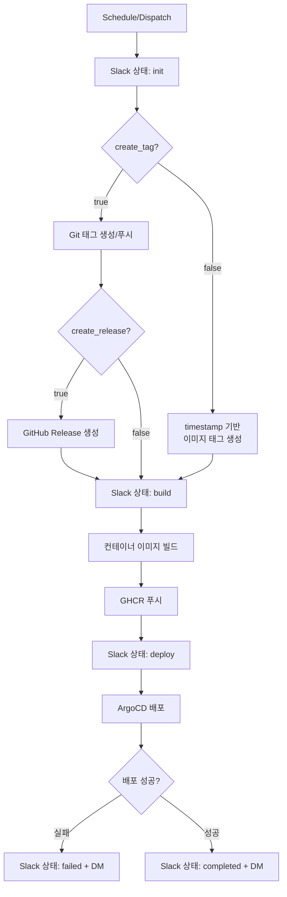
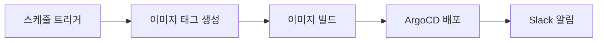
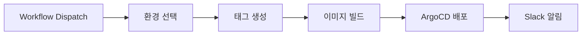

# 3. 배포 주기 및 프로세스

## 개요

배포 목적에 따라 구분하고 각 단계의 배포 주기와 방식, 트리거 조건을 정의한다.

---

## 배포 구분

### **1. 개발 (Dev)**

- **배포 주기**: 평일 매일 오전 7시 (자동), 필요 시 수동 트리거
- **배포 방식**: 자동 (스케줄), 반자동 (수동 트리거)
- **배포 트리거**: GitHub Actions 스케줄, Workflow Dispatch
- **주요 목적**:
    - CI/CD 파이프라인 안정성 검증
    - 일일 빌드 무결성 검증
    - 버그 및 회귀 이슈 조기 발견
    - Stage 배포 전, 개발 단계

### **2. 스테이지 (Stage)**

- **배포 주기**: 개발 환경에서 검증 완료 후 배포
- **배포 방식**: 반자동 (트리거는 수동, 빌드/배포는 자동)
- **배포 트리거**: GitHub Workflow Dispatch
- **주요 목적**:
    - 릴리즈 후보 안정성 검증
    - 프로덕션 배포 전 QA
    - 성능 및 통합 안정성 테스트
    - Prod 배포 전, 검증 단계

### **3. 프로덕션 (Production)**

- **배포 주기**: 스테이지 환경에서 검증 완료 후 배포
- **배포 방식**: 반자동 (트리거는 수동, 빌드/배포는 자동)
- **배포 트리거**: GitHub Workflow Dispatch
- **주요 목적**:
    - 고객 제공 전 최종 검증
    - 실 운영 환경과 동일한 조건에서 테스트
    - 최종 릴리즈 승인

---

## 배포 파이프라인

> **참고**: 개발 환경 스케줄 배포는 Git 태그/Release 없이 timestamp 기반 이미지 태그만 생성

### Phase 1: 태그 생성

**이미지 태그**

| 환경 | 기본 (timestamp) | Git 태그 생성 시 |
|------|-------------------|------------------|
| 개발 | `dev-{yyMMddHHmm}` | `v{major}.{minor}.{patch}-dev.{seq}` |
| 스테이지 | `rc-{yyMMddHHmm}` | `v{major}.{minor}.{patch}-rc.{seq}` |
| 프로덕션 | `rc-{yyMMddHHmm}` | `v{major}.{minor}.{patch}` |

**GitHub Release**

- 개발/스테이지: Pre-release
- 프로덕션: 정식 Release

### Phase 2: 빌드

**컨테이너 이미지 빌드**

- Multi-platform 빌드 (linux/amd64, linux/arm64)
- 빌드 대상: WebUI (Backend 포함), MCP
- GHCR (GitHub Container Registry)에 푸시

### Phase 3: 배포

**ArgoCD 배포**

배포 순서:

1. **PostgreSQL** - 데이터베이스
2. **WebUI** - Backend + Frontend
3. **MCP** - MCP 서버

- Helm 차트에 이미지 태그 설정
- ArgoCD Sync 실행 및 Health Check 대기

### Phase 4: 알림

**Slack 알림**

- 각 단계별 상태 변경 (init, build, deploy, completed/failed)
- 완료/실패 시 담당자에게 DM 발송

---

## 배포 자동화

### 개발 환경 자동 배포

**트리거**: 평일 매일 오전 7시 KST

- Git 태그 및 이미지 태그 생성
- 빠른 반복 배포에 최적화

### 스테이지/프로덕션 반자동 배포

**트리거**: GitHub Workflow Dispatch

**배포 절차**:

1. GitHub Actions에서 워크플로우 실행
2. 대상 환경 선택 (stage 또는 prod)
3. 이후 자동으로 빌드 및 배포 실행
